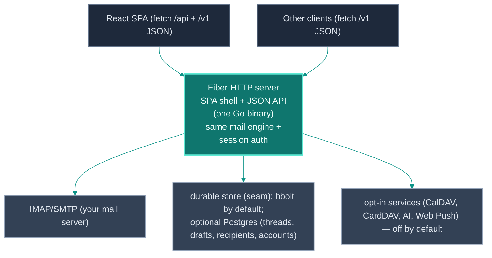
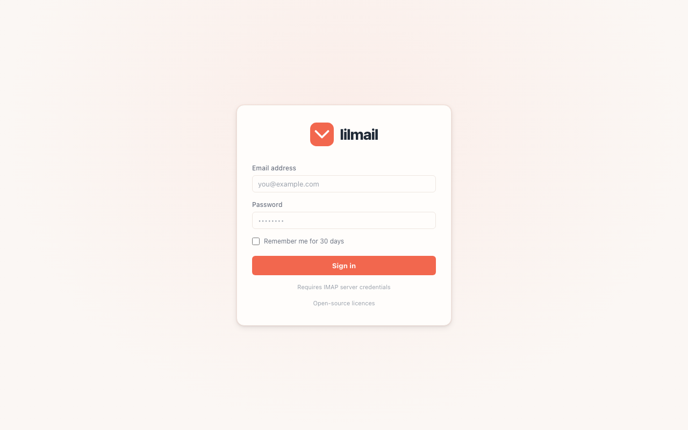
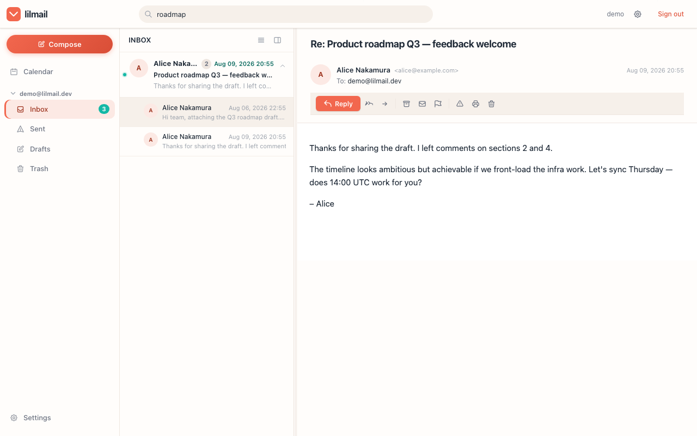

<div align="center">


**A lightweight self-hostable PIM client — mail + calendar + contacts — in a single Go binary.**

**[MIT OR Apache-2.0](LICENSE-MIT) · [Download](https://github.com/vul-os/lilmail/releases/latest) · [CI](https://github.com/vul-os/lilmail/actions/workflows/ci.yml)**

<br>


</div>

---

## What is lilmail?

lilmail is a self-hostable **PIM client** — mail, calendar, and contacts — that
connects to the **user's own** IMAP/SMTP + CalDAV + CardDAV account and ships as
**one self-contained Go binary**. The production React/Vite bundle and browser
assets are embedded via `embed.FS` — no CDN or external services to
run by default. Drop the binary next to a `config.toml` and it runs,
comfortably, on 64 MB of RAM.

Log in with a classic username/password or **OAuth2 / OpenID Connect** (full
PKCE flow with XOAUTH2 and OAUTHBEARER SASL and automatic token refresh).
The core mail path includes a local SQLite mirror enabled by default: a
background worker polls IMAP, while inbox pages read synchronized metadata from
SQLite. CalDAV calendar, CardDAV contacts, an AI mail assistant, real-time
notifications, and Web Push remain opt-in via config keys.

lilmail is a fully **independent project** — think Evolution + Evolution-Data-
Server for the web. It talks to the **user's own** accounts (Gmail, Outlook, any
IMAP/CalDAV/CardDAV) over OAuth/password and exposes a stable **`/v1`** JSON API
(mail + `/v1/calendar` + `/v1/contacts`) that any rich client can build on.

**Bring your own mailbox.** lilmail hosts no mail server. You can either sign in
directly with a mailbox, or create a local lilmail application account and attach
multiple IMAP/SMTP mailboxes to it. Application passwords and mailbox passwords
are separate; mailbox credentials are encrypted with `[encryption].key`.

## Features

- **Single binary (~24 MB), no external database service** — the React bundle and
  browser assets are embedded with `embed.FS`; durable state uses an embedded [bbolt](https://github.com/etcd-io/bbolt)
  file by default and the mail mirror uses pure-Go SQLite; an **optional Postgres
  backend** remains available for shared KV state; runs fully offline/air-gapped
  with only `config.toml`
- **Local mail mirror** — IMAP headers and full MIME messages are synchronized
  in the background to `./cache/mail.db`; normal inbox, folder, search, and
  message-detail reads do not wait on IMAP. Set `sync_bodies = false` only when
  reducing local disk/network use is more important than offline detail reads.
- **IMAP** mailbox browsing and **SMTP** sending
- **JSON API** (`/v1`) — the backend contract for React and other clients (folders/labels, paginated
  messages, search, flags, move/archive/spam, delete, snooze, compose + drafts,
  attachment upload/download, scheduled send, calendar, contacts, settings) for
  rich clients, backed by the same mail engine and session auth. See [docs/API.md](docs/API.md).
- **OAuth2 / OpenID Connect** — authorization-code flow, PKCE (S256), automatic
  refresh-token handling, XOAUTH2 and OAUTHBEARER SASL; password login still works
- **Conversation threading** — JWZ algorithm (`References` / `In-Reply-To` /
  `Message-ID`) backed by an embedded [bbolt](https://github.com/etcd-io/bbolt) store
- **Compose** — plain-text and HTML rich-text (contenteditable toolbar), file
  attachments (multipart/mixed MIME) with `cid:` inline images
  (multipart/related), scheduled send (send-later, `/v1`), drafts with 30-second
  auto-save plus IMAP APPEND/restore. Outgoing headers are guarded against
  CR/LF/NUL header injection
- **Recipient autocomplete** — recent-recipients store with optional CardDAV
  address-book lookup
- **Calendar (CalDAV) + meeting invites** — month/week views, event CRUD,
  free/busy, and end-to-end iTIP/iMIP invites (send a `METHOD:REQUEST`, parse a
  received invite, RSVP with `METHOD:REPLY`) — opt-in via `[caldav]`
- **Contacts (CardDAV)** — full-card CRUD over `/v1`, groups (as vCard
  `CATEGORIES`), starred, raster-only photo upload, and vCard/CSV import + export
  — opt-in via `[carddav]`
- **Real-time notifications** — IMAP IDLE watcher, SSE stream, browser
  notifications, native desktop toasts, and VAPID Web Push — opt-in via `[notifications]`
- **AI mail assistant** — smart compose, thread summaries, reply suggestions,
  action-item extraction, and phishing detection via any OpenAI-compatible
  endpoint — opt-in via `[ai]`
- **Multiple accounts** — register one lilmail application account, attach and
  switch several IMAP/SMTP mailboxes, and use a local unified inbox
- **Security-first** — JWT sessions, AES-256-GCM encrypted credentials at rest,
  an origin-pinned Content-Security-Policy, `SameSite=Lax` cookies, an email iframe sandboxed without `allow-scripts`
- **Dark mode** — hand-written CSS, no CDN dependency
- Builds and runs on **Linux, macOS, and Windows**

## How it works

lilmail is a [Fiber](https://gofiber.io/) application. The browser is a React/Vite
SPA and the Go process provides the JSON API, session/auth endpoints, and the
embedded SPA shell. The release build embeds the Vite bundle and static assets
into the Go binary.



State that must survive a restart (local users, mailbox credentials, folders,
message metadata, cached bodies, conversation threads, recent recipients, VAPID
keys, scheduled sends) lives in `cache/mail.db`, bbolt, or the optional shared
Postgres store depending on the subsystem. IMAP remains the source of truth;
SQLite is a local mirror, not a replacement mail server. Session and stored
mailbox credentials are AES-256-GCM encrypted. The same mail engine backs both
the React browser client and the `/v1` JSON API. See
[docs/ARCHITECTURE.md](docs/ARCHITECTURE.md) for the request lifecycle and
[docs/API.md](docs/API.md) for the JSON API reference.

**Injected-credential mode (optional, off by default).** Normally lilmail holds
its own session and connects to the user's mailbox itself. As an option, an
embedding host (or the test harness) may inject the per-request connection spec as
`X-Vulos-Broker-Auth` + `X-Vulos-Mail-*` headers, so lilmail builds the IMAP/SMTP/
DAV client straight from the headers. Those headers only ever describe the **user's
own** account. The path is gated by a shared secret (`LILMAIL_BROKER_SECRET`,
matched in constant time): **if the secret is unset or mismatched, the headers are
ignored entirely** and the request falls back to normal session auth, so standalone
lilmail never trusts client-supplied connection headers. Each request's spec is
**copied out of the transport buffer** as it is parsed, so one request can never
mutate another's retained spec — per-account routing stays isolated even under a
pooled/concurrent server. See [docs/API.md](docs/API.md) → *Injected-credential
mode*.

## Quick start

```bash
# Clone
git clone https://github.com/vul-os/lilmail.git
cd lilmail

# Configure — copy the example and replace its security secrets
cp config.toml.example config.toml   # then edit

# Build and run the single-process production-style server
make build && ./lilmail
```

Open **http://localhost:2342** and sign in.

Prefer a pre-built binary? Grab the archive for your OS and CPU from the
[latest release](https://github.com/vul-os/lilmail/releases/latest): macOS and
Linux, `amd64` and `arm64`, plus a source zip and a `SHA256SUMS` manifest
covering every asset. Only `config.toml` needs to be present alongside it.

### Verify a release before you run it

Every release publishes a `SHA256SUMS` manifest covering **all** of its assets,
plus a sigstore build-provenance attestation minted from the release workflow's
OIDC identity (there is no long-lived signing key, so there is none to leak or
rotate). `scripts/verify.sh` is what you run before executing the bytes:

```bash
curl -fsSLO https://raw.githubusercontent.com/vul-os/lilmail/v1.14.0/scripts/verify.sh
bash verify.sh --tag v1.14.0 --attest lilmail_1.14.0_linux_amd64.zip
```

It fetches the manifest, looks up the **exact** entry for that asset (names are
compared as strings, not as regexes) and compares digests. Two outcomes only:
verified, or non-zero with a diagnostic naming what was wrong — missing or
malformed manifest, no entry for the asset, truncated download, digest mismatch,
HTML error page served where bytes were expected. There is no `--skip-verify`,
and a `SHA256SUMS` that 404s is a **failure**, never "nothing to check".
`--attest` additionally verifies the provenance (needs the `gh` CLI); leave it
off and the script says out loud that provenance was *not* checked, so a pass
never implies more than it checked.

`make verify-selftest` runs 24 synthetic-origin cases asserting that each
refusal still fires; CI runs the same matrix on every push.

## Configuration

Deployment settings live in `config.toml`; mailbox servers and AI models are
managed from the Settings UI. A minimal setup needs only connection policies
and two security secrets:

```toml
[server]
port = 2342

[imap]
tls    = true

[smtp]
use_starttls = true

[jwt]
secret = "your-secure-jwt-secret"

[encryption]
key = "your-32-character-encryption-key"   # exactly 32 chars (AES-256)
```

Optional deployment sections — `[oauth2]`, `[ssl]`, `[notifications]`,
`[caldav]`, and `[carddav]` — are default-disabled. `[mail_sync]` is enabled by
default and provides the local user/multi-mailbox flow. See
[`config.toml.example`](config.toml.example) for the starter template, or
[docs/CONFIGURATION.md](docs/CONFIGURATION.md) for every available key.

## Documentation

| Document | Description |
|----------|-------------|
| [docs/GETTING-STARTED.md](docs/GETTING-STARTED.md) | Installation, first-run, and basic configuration walkthrough |
| [docs/ARCHITECTURE.md](docs/ARCHITECTURE.md) | Code layout, request lifecycle, and subsystem overview |
| [docs/API.md](docs/API.md) | `/v1` JSON API reference — endpoints, auth, payloads |
| [docs/SIGNING.md](docs/SIGNING.md) | Request authentication on the wire — broker secrets, AWS SigV4, known-answer vectors |
| [docs/CONFIGURATION.md](docs/CONFIGURATION.md) | Complete `config.toml` reference — every key, section, and default |
| [docs/SCREENSHOTS.md](docs/SCREENSHOTS.md) | Screenshot gallery and how to regenerate them |
| [ROADMAP.md](ROADMAP.md) | Shipped features, planned work, and exploratory ideas |
| [CHANGELOG.md](CHANGELOG.md) | Per-release changelog (Keep a Changelog format) |

## Screenshots

| Login | Inbox | Message view |
|-------|-------|--------------|
|  |  |  |

| Compose | Settings | Search |
|---------|----------|--------|
|  |  |  |

See [docs/SCREENSHOTS.md](docs/SCREENSHOTS.md) for the full gallery and how to
regenerate screenshots.

## Development

```bash
npm install
make dev             # Vite HMR on :2342; Go API/auth server on :3001
make build         # build frontend + Go binary
make test          # go test ./...
make vet           # go vet ./...
make check         # build + vet + test
go run main.go     # single-process run (after npm run build for React UI)
./lilmail -version # print version and exit
```

During frontend development, open **http://localhost:2342** after `make dev`.
Vite serves the React source with HMR and proxies `/api`, `/v1`, authentication,
and other backend routes to Go on `3001`; `go run main.go` by itself serves the
embedded `frontend/dist` bundle and therefore does not provide HMR. To run the
two processes manually, use `LILMAIL_RUNTIME_DIR="$PWD" go run main.go -port 3001`
in one terminal and
`npm run dev` in another. Set `VITE_BACKEND_URL` if the Go server runs elsewhere.

Cross-compile for any supported platform:

```bash
npm run build
GOOS=linux   GOARCH=amd64 go build -o lilmail-linux-amd64
GOOS=darwin  GOARCH=arm64 go build -o lilmail-darwin-arm64
GOOS=windows GOARCH=amd64 go build -o lilmail-windows-amd64.exe
```

### Regenerate screenshots

```bash
make screenshots        # boots lilmail + runs the Playwright screenshotter
make demo-screenshots   # uses the in-memory demo inbox — no IMAP/SMTP needed
```

Requires Node 18+ and Playwright Chromium. See
[docs/SCREENSHOTS.md](docs/SCREENSHOTS.md) for which screenshots need a live IMAP
account.

## Contributing

Contributions are welcome. Please open an issue to discuss substantial changes
before sending a pull request, and make sure the following passes first:

```bash
make check   # frontend build + go build + go vet + go test
```

## Brand

The mark in [`brand/`](brand/) is the source of truth. Every icon this repo
ships — favicon, PWA and app icons, the mark in the README and on the site — is
rendered from `brand/logo.svg` rather than redrawn, so there is one approved
drawing and no second copy to drift.

Copy it outward, never edit a derived copy, and never edit `brand/` to match
something downstream.

## License

[MIT](LICENSE-MIT) OR [Apache-2.0](LICENSE-APACHE) — © VulOS. lilmail is a VulOS
project; source and issues at [github.com/vul-os/lilmail](https://github.com/vul-os/lilmail).

### Third-party notices

lilmail redistributes third-party software: Go modules compiled into the binary
and browser assets served to the browser. Their
licences (MIT, BSD, ISC, Apache-2.0) require the copyright notice and licence
text to accompany every copy, so lilmail ships them:

- [THIRD-PARTY-NOTICES.txt](THIRD-PARTY-NOTICES.txt) — name, version, licence and
  full licence text for every component. Generated from the real dependency graph
  by `make notices` (`scripts/gen-notices.sh`); never hand-edited.
- A running lilmail serves it at **`/licenses.txt`**.

---

<p align="center">
  <a href="https://vulos.org"></a><br>
  <sub><a href="https://vulos.org"><b>vulos</b></a> — open by design</sub>
</p>
