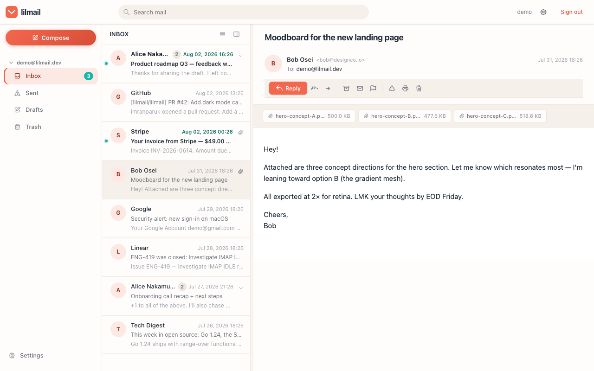
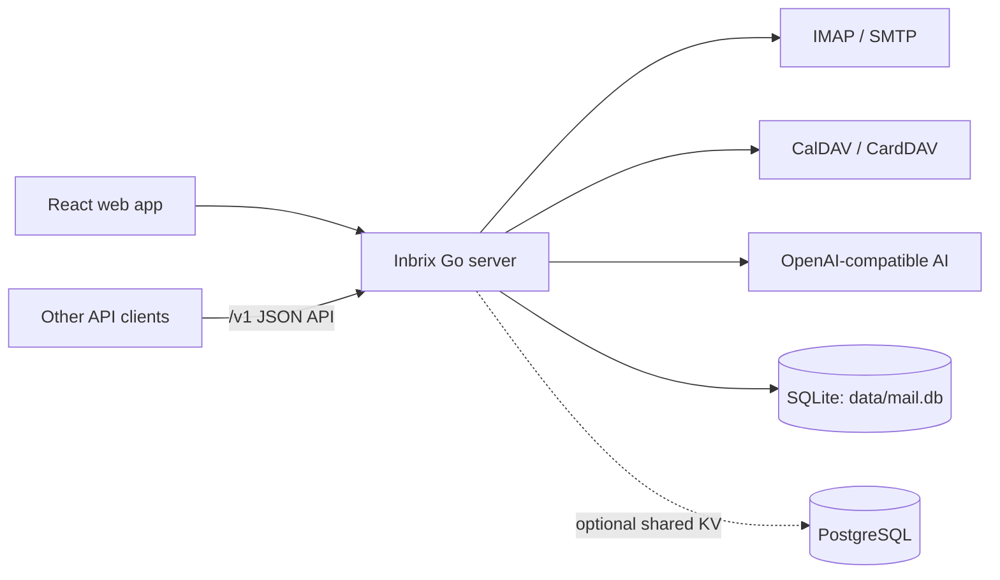
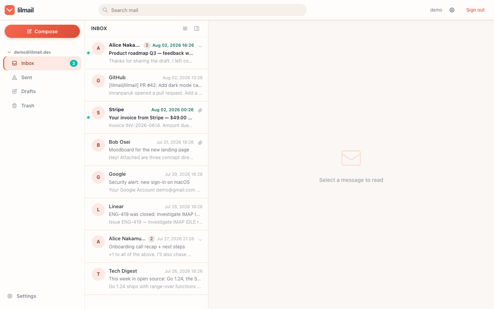
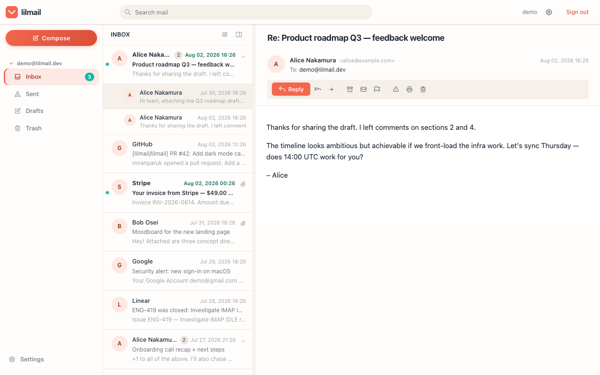
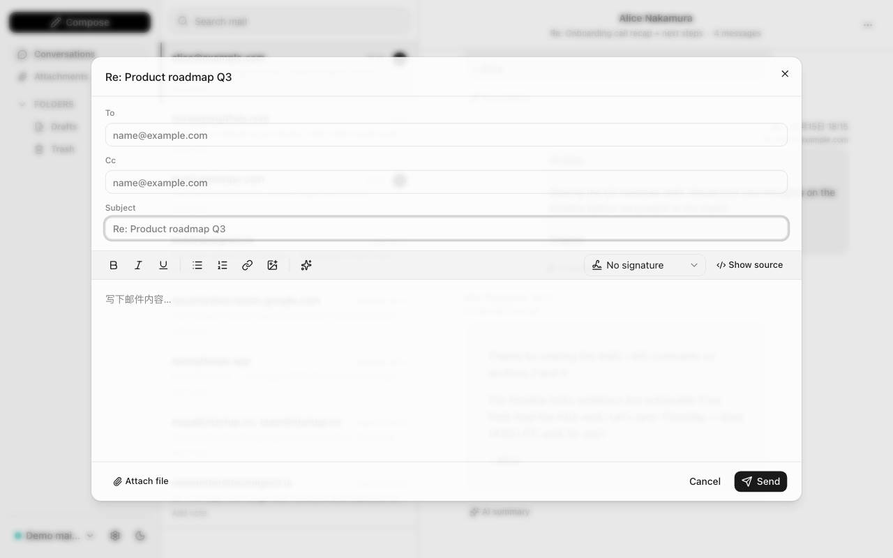
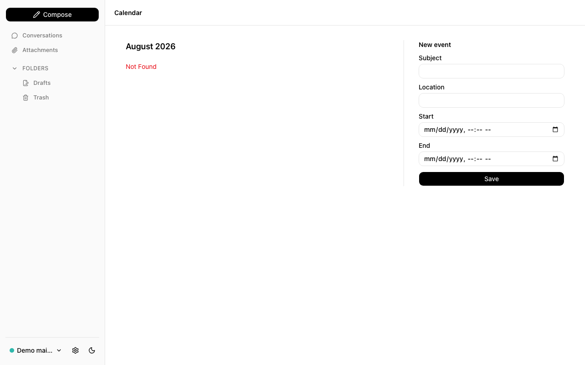
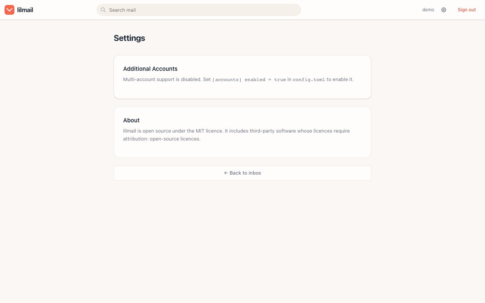
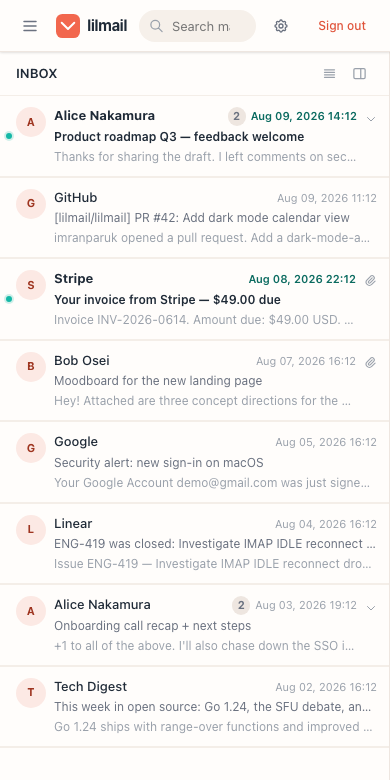

<div align="center">


# Inbrix AI

[](https://go.dev/)
[](https://react.dev/)
[](https://www.typescriptlang.org/)
[](https://www.docker.com/)
[](LICENSE-MIT)

**A self-hosted AI mail workspace with calendar and contacts built in.**

English | [中文](README_CN.md)

<p>
  <a href="https://github.com/voidvon/inbrix/releases/latest">Download</a> ·
  <a href="docs/GETTING-STARTED.md">Getting Started</a> ·
  <a href="docs/CONFIGURATION.md">Configuration</a> ·
  <a href="docs/API.md">API</a>
</p>



</div>

## Overview

Inbrix AI is a self-hosted workspace for email, calendar, contacts, and
AI-assisted workflows. It connects directly to your existing IMAP/SMTP,
CalDAV, and CardDAV services, so there is no mailbox migration and no new mail
provider to trust.

The React application is embedded into a single Go binary. Local users,
mailboxes, synchronized messages, scheduled sends, thread metadata, recent
recipients, settings, and Push subscriptions are stored in one SQLite database
by default. No external database server is required for a standalone instance.

> Inbrix AI is an email client, not an email server. You need an existing
> mailbox with IMAP and SMTP access.

## Core Features

- **Unified mail workspace** - browse IMAP folders, search messages, manage
  flags, archive, move, delete, snooze, and switch between multiple mailboxes.
- **Local mail mirror** - synchronize message metadata and MIME bodies to
  SQLite for fast inbox, search, and message-detail views.
- **One local database** - application accounts, mail cache, settings,
  scheduled sends, threads, recipients, and Push subscriptions share
  `data/mail.db`.
- **Rich composition** - HTML and plain-text email, attachments, inline images,
  drafts with auto-save, signatures, scheduled sending, reply, and forward.
- **Conversation threading** - group related messages using `Message-ID`,
  `References`, and `In-Reply-To` headers.
- **AI mail assistant** - connect any OpenAI-compatible model for drafting,
  summaries, reply suggestions, action extraction, and phishing analysis.
- **Calendar and contacts** - optional CalDAV event management, meeting invite
  handling, and CardDAV contact synchronization.
- **Multiple accounts** - create one local application account and attach
  several IMAP/SMTP mailboxes with a unified inbox.
- **Real-time notifications** - IMAP IDLE, server-sent events, browser alerts,
  desktop notifications, and optional Web Push.
- **JSON API** - a stable `/v1` API for mail, calendar, contacts, settings,
  attachments, drafts, and scheduled sends.
- **Security by default** - AES-GCM encrypted mailbox credentials, JWT-backed
  sessions, CSRF protection, Content Security Policy, rate limits, and sandboxed
  email rendering.
- **Responsive interface** - desktop and mobile layouts, dark mode, and English
  and Chinese UI support.
- **Simple deployment** - one self-contained binary or a small Docker image;
  runs on Linux and macOS, on `amd64` and `arm64`.

## Technology Stack

| Component | Technology |
|---|---|
| Backend | Go 1.25+, Fiber |
| Frontend | React 19, TypeScript 6, Vite 8, Tailwind CSS 4 |
| Editor and data fetching | Tiptap, TanStack Query |
| Local storage | SQLite |
| Optional shared KV state | PostgreSQL |
| Mail | IMAP, SMTP, MIME |
| Calendar and contacts | CalDAV, CardDAV, iTIP/iMIP |
| AI | OpenAI-compatible endpoints, optional embedded llmux |

## Architecture and Storage



IMAP remains the source of truth for mail. SQLite is the local application
database and synchronized mail mirror. Configuring PostgreSQL moves the
backend-agnostic KV namespaces used by features such as scheduled sends,
settings, thread metadata, recent recipients, and Push subscriptions; it does
not replace the local SQLite mail mirror.

The default persistent layout is:

| Path | Purpose |
|---|---|
| `data/mail.db` | SQLite application data and synchronized mail |
| `data/sessions/` | Server-side browser sessions |
| `data/vapid.json` | Web Push identity, created only when Web Push is enabled |
| `config.toml` | Deployment configuration and encryption key |

Back up `data/` and `config.toml` together. The encryption key in
`config.toml` is required to decrypt stored mailbox credentials.

## Quick Start

### Prerequisites

- Go 1.25+ and Node.js 24+ when building from source
- An IMAP/SMTP mailbox
- CalDAV and CardDAV accounts only when those integrations are enabled

### Build from source

```bash
git clone https://github.com/voidvon/inbrix.git
cd inbrix

cp config.toml.example config.toml
# Replace jwt.secret and encryption.key in config.toml before deployment.

npm ci
make build
./inbrix
```

Open [http://localhost:2342](http://localhost:2342), register the first local
account, and add a mailbox from Settings. The first registered account becomes
the super administrator.

Pre-built archives for Linux and macOS are available from
[GitHub Releases](https://github.com/voidvon/inbrix/releases/latest).

### Verify a release

Each release includes a `SHA256SUMS` manifest. Verify an archive before running
it (replace the platform in the filename when needed):

```bash
curl -fsSLO https://raw.githubusercontent.com/voidvon/inbrix/v1.16.0/scripts/verify.sh
bash verify.sh --repo voidvon/inbrix --tag v1.16.0 inbrix_1.16.0_linux_amd64.zip
```

### Run with Docker

```bash
git clone https://github.com/voidvon/inbrix.git
cd inbrix

cp config.toml.example config.toml
# Replace jwt.secret and encryption.key in config.toml before deployment.
mkdir -p data

docker build -t inbrix .
docker run -d \
  --name inbrix \
  --restart unless-stopped \
  -p 2342:2342 \
  -v "$PWD/config.toml:/app/config.toml:ro" \
  -v "$PWD/data:/app/data" \
  inbrix
```

The container stores persistent state under `/app/data`; keep the mounted
directory and `config.toml` backed up together.

## Configuration

Deployment settings live in `config.toml`. Mailbox servers and AI models are
managed from the Settings page after sign-in. A minimal configuration is:

```toml
[server]
port = 2342
secure_cookies = false

[auth]
allow_full_email_username = true

[imap]
tls = true

[smtp]
use_starttls = true

[jwt]
secret = "replace-with-a-long-random-secret"

[encryption]
# Must be exactly 16, 24, or 32 bytes.
key = "replace-this-32-byte-key-now!!!!"
```

Use `secure_cookies = true` behind HTTPS. OAuth2/OIDC, PostgreSQL-backed shared
KV state, Web Push, CalDAV, CardDAV, AI, and rate-limit overrides are optional. See
[`config.toml.example`](config.toml.example) and the
[configuration reference](docs/CONFIGURATION.md) for all settings.

## Screenshots

| Inbox | Message | Compose |
|---|---|---|
|  |  |  |

| Calendar | Settings | Mobile |
|---|---|---|
|  |  |  |

See the [screenshot guide](docs/SCREENSHOTS.md) for the full gallery and
regeneration instructions.

## Documentation

| Document | Description |
|---|---|
| [Getting Started](docs/GETTING-STARTED.md) | Installation, first run, and common deployment scenarios |
| [Configuration](docs/CONFIGURATION.md) | Complete `config.toml` reference |
| [API Reference](docs/API.md) | Authentication and `/v1` JSON endpoints |
| [Architecture](docs/ARCHITECTURE.md) | Components, storage, and request lifecycle |
| [Request Signing](docs/SIGNING.md) | Broker authentication and signing details |
| [Roadmap](ROADMAP.md) | Shipped, planned, and exploratory work |
| [Changelog](CHANGELOG.md) | Release history |
| [Security Policy](SECURITY.md) | Supported versions and vulnerability reporting |

## Development

```bash
npm ci
make dev          # Vite on :2342, Go backend on :3001
make build        # Build the frontend and embedded Go binary
make test         # Run Go tests
make vet          # Run Go static analysis
npm run lint      # Lint TypeScript and React code
make check        # Run the complete project verification suite
```

For frontend development, open [http://localhost:2342](http://localhost:2342)
after `make dev`. Vite serves the React source with hot reload and proxies API
requests to the Go process.

## Contributing

Issues and pull requests are welcome. For substantial changes, open an issue
first so the implementation can be discussed. Run `make check` before
submitting a pull request.

Please report security vulnerabilities according to [SECURITY.md](SECURITY.md)
instead of opening a public issue.

## License

Inbrix AI is available under either the [MIT License](LICENSE-MIT) or the
[Apache License 2.0](LICENSE-APACHE), at your option.

Third-party components and their license texts are listed in
[THIRD-PARTY-NOTICES.txt](THIRD-PARTY-NOTICES.txt) and served by a running
instance at `/licenses.txt`.
