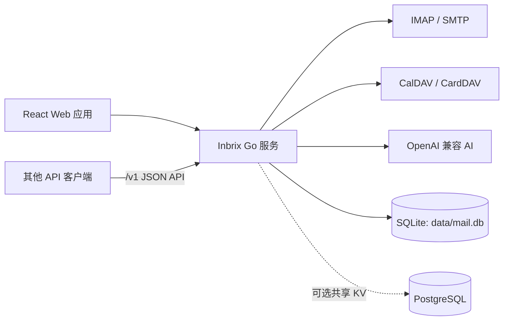

<div align="center">


# Inbrix AI

[](https://go.dev/)
[](https://react.dev/)
[](https://www.typescriptlang.org/)
[](https://www.docker.com/)
[](LICENSE-MIT)

**可自托管的 AI 邮件工作台，内置日历与联系人。**

[English](README.md) | 中文

<p>
  <a href="https://github.com/voidvon/inbrix/releases/latest">下载</a> ·
  <a href="docs/GETTING-STARTED.md">快速开始</a> ·
  <a href="docs/CONFIGURATION.md">配置说明</a> ·
  <a href="docs/API.md">API 文档</a>
</p>


</div>

## 项目概述

Inbrix AI 是一款可自托管的邮件、日历、联系人与 AI 协作工作台。它直接
连接现有的 IMAP/SMTP、CalDAV 和 CardDAV 服务，无需迁移邮箱，也无需将
邮件托管给新的服务商。

React 应用会嵌入到一个 Go 二进制文件中。默认情况下，本地用户、邮箱、
同步邮件、定时发送、会话元数据、最近联系人、设置和 Push 订阅统一保存
在一个 SQLite 数据库中，单机部署不需要额外的数据库服务。

> Inbrix AI 是邮件客户端，不是邮件服务器。使用前需要准备支持 IMAP 和
> SMTP 的现有邮箱。

## 核心功能

- **统一邮件工作台** - 浏览 IMAP 文件夹、搜索邮件、管理标记、归档、
  移动、删除、稍后提醒，并可在多个邮箱之间切换。
- **本地邮件镜像** - 将邮件元数据和 MIME 正文同步到 SQLite，快速加载
  收件箱、搜索结果和邮件详情。
- **单一本地数据库** - 应用账号、邮件缓存、设置、定时发送、会话、最近
  联系人和 Push 订阅统一存储在 `data/mail.db`。
- **富文本写信** - 支持 HTML 与纯文本、附件、内嵌图片、草稿自动保存、
  签名、定时发送、回复和转发。
- **会话聚合** - 基于 `Message-ID`、`References` 和 `In-Reply-To` 将相关
  邮件整理为会话。
- **AI 邮件助手** - 可接入任意 OpenAI 兼容模型，提供邮件撰写、内容总结、
  回复建议、待办提取和钓鱼邮件分析。
- **日历与联系人** - 可选的 CalDAV 日程管理、会议邀请处理和 CardDAV
  联系人同步。
- **多账号管理** - 一个本地应用账号可绑定多个 IMAP/SMTP 邮箱，并使用
  统一收件箱。
- **实时通知** - 支持 IMAP IDLE、SSE、浏览器通知、桌面通知和可选 Web Push。
- **JSON API** - 提供稳定的 `/v1` API，覆盖邮件、日历、联系人、设置、
  附件、草稿和定时发送。
- **默认安全** - 邮箱凭据采用 AES-GCM 加密，配合 JWT 会话、CSRF 防护、
  内容安全策略、速率限制和沙箱化邮件渲染。
- **响应式界面** - 适配桌面和移动端，支持深色模式及中英文界面。
- **部署简单** - 可使用单个自包含二进制文件或精简 Docker 镜像，支持
  Linux 和 macOS 的 `amd64`、`arm64` 架构。

## 技术栈

| 组件 | 技术 |
|---|---|
| 后端 | Go 1.25+、Fiber |
| 前端 | React 19、TypeScript 6、Vite 8、Tailwind CSS 4 |
| 编辑器与数据请求 | Tiptap、TanStack Query |
| 本地存储 | SQLite |
| 可选共享 KV 状态 | PostgreSQL |
| 邮件协议 | IMAP、SMTP、MIME |
| 日历与联系人 | CalDAV、CardDAV、iTIP/iMIP |
| AI | OpenAI 兼容接口、可选内嵌 llmux |

## 架构与存储



IMAP 始终是邮件的事实来源，SQLite 则承担本地应用数据库和邮件同步镜像。
配置 PostgreSQL 后，定时发送、设置、会话元数据、最近联系人和 Push 订阅
等后端无关的 KV 命名空间会改用 PostgreSQL；本地 SQLite 邮件镜像不会被
PostgreSQL 替代。

默认持久化文件如下：

| 路径 | 用途 |
|---|---|
| `data/mail.db` | SQLite 应用数据和同步邮件 |
| `data/sessions/` | 服务端浏览器会话 |
| `data/vapid.json` | Web Push 身份文件，仅在启用 Web Push 时创建 |
| `config.toml` | 部署配置与加密密钥 |

请将 `data/` 和 `config.toml` 一起备份。配置文件中的加密密钥是解密已保存
邮箱凭据所必需的。

## 快速开始

### 环境要求

- 从源码构建需要 Go 1.25+ 和 Node.js 24+
- 一个支持 IMAP/SMTP 的邮箱
- 仅在启用相关集成时需要 CalDAV 和 CardDAV 账号

### 从源码构建

```bash
git clone https://github.com/voidvon/inbrix.git
cd inbrix

cp config.toml.example config.toml
# 部署前请修改 config.toml 中的 jwt.secret 和 encryption.key。

npm ci
make build
./inbrix
```

打开 [http://localhost:2342](http://localhost:2342)，注册第一个本地账号，
然后在设置中添加邮箱。首个注册账号会自动成为超级管理员。

Linux 和 macOS 的预编译压缩包可在
[GitHub Releases](https://github.com/voidvon/inbrix/releases/latest) 下载。

### 校验发行文件

每个版本都会提供 `SHA256SUMS` 清单。运行下载的程序前请先校验压缩包
（其他平台请替换对应文件名）：

```bash
curl -fsSLO https://raw.githubusercontent.com/voidvon/inbrix/v1.14.0/scripts/verify.sh
bash verify.sh --repo voidvon/inbrix --tag v1.14.0 inbrix_1.14.0_linux_amd64.zip
```

### 使用 Docker 运行

```bash
git clone https://github.com/voidvon/inbrix.git
cd inbrix

cp config.toml.example config.toml
# 部署前请修改 config.toml 中的 jwt.secret 和 encryption.key。
mkdir -p data

docker build -t inbrix .
docker run -d \
  --name inbrix \
  --restart unless-stopped \
  -p 2342:2342 \
  -v "$PWD/config.toml:/app/config.toml:ro" \
  -v "$PWD/data:/app/data" \
  inbrix
```

容器的持久化数据位于 `/app/data`。请将挂载的数据目录和 `config.toml`
一起备份。

## 配置说明

部署参数保存在 `config.toml` 中。登录后可在设置页面管理邮箱服务器和 AI
模型。最小配置如下：

```toml
[server]
port = 2342
secure_cookies = false

[auth]
allow_full_email_username = true

[imap]
tls = true

[smtp]
use_starttls = true

[jwt]
secret = "replace-with-a-long-random-secret"

[encryption]
# 长度必须恰好为 16、24 或 32 字节。
key = "replace-this-32-byte-key-now!!!!"
```

通过 HTTPS 部署时，请设置 `secure_cookies = true`。OAuth2/OIDC、由
PostgreSQL 承载的共享 KV 状态、Web Push、CalDAV、CardDAV、AI 和自定义
速率限制均为可选功能。全部参数请参阅
[`config.toml.example`](config.toml.example) 和
[配置参考](docs/CONFIGURATION.md)。

## 界面预览

| 收件箱 | 邮件详情 | 写邮件 |
|---|---|---|
|  |  |  |

| 日历 | 设置 | 移动端 |
|---|---|---|
|  |  |  |

完整图片及重新生成方式请参阅[截图指南](docs/SCREENSHOTS.md)。

## 项目文档

| 文档 | 说明 |
|---|---|
| [快速开始](docs/GETTING-STARTED.md) | 安装、首次运行和常见部署场景 |
| [配置参考](docs/CONFIGURATION.md) | 完整的 `config.toml` 参数说明 |
| [API 文档](docs/API.md) | 身份验证和 `/v1` JSON 接口 |
| [系统架构](docs/ARCHITECTURE.md) | 组件、存储和请求生命周期 |
| [请求签名](docs/SIGNING.md) | Broker 身份验证与签名机制 |
| [路线图](ROADMAP.md) | 已完成、计划中和探索中的功能 |
| [更新日志](CHANGELOG.md) | 版本发布记录 |
| [安全策略](SECURITY.md) | 支持版本与漏洞报告方式 |

## 本地开发

```bash
npm ci
make dev          # Vite 运行于 :2342，Go 后端运行于 :3001
make build        # 构建前端和内嵌资源的 Go 二进制文件
make test         # 运行 Go 测试
make vet          # 运行 Go 静态分析
npm run lint      # 检查 TypeScript 和 React 代码
make check        # 运行完整的项目验证流程
```

前端开发时，执行 `make dev` 后访问
[http://localhost:2342](http://localhost:2342)。Vite 提供 React 热更新，并将
API 请求代理到 Go 进程。

## 参与贡献

欢迎提交 Issue 和 Pull Request。对于较大的改动，请先创建 Issue 讨论实现
方案。提交 Pull Request 前请运行 `make check`。

发现安全漏洞时，请按照 [SECURITY.md](SECURITY.md) 中的方式私下报告，不要
创建公开 Issue。

## 开源许可

Inbrix AI 采用 [MIT License](LICENSE-MIT) 或
[Apache License 2.0](LICENSE-APACHE) 双许可证，使用者可任选其一。

第三方组件及其许可证全文收录于
[THIRD-PARTY-NOTICES.txt](THIRD-PARTY-NOTICES.txt)，运行中的实例也会在
`/licenses.txt` 提供该文件。
