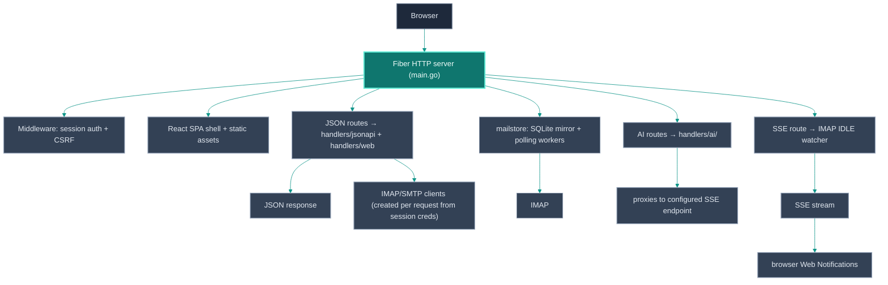

# Architecture

lilmail is a Go web application using the [Fiber](https://gofiber.io/) HTTP
framework. The React/Vite frontend and browser assets are embedded in the
release binary at build time via `embed.FS`. During local UI development, Vite
serves the React source separately and proxies backend requests to the Go
process.

## Repository layout

```text
lilmail/
├── main.go                  # Entry point: config, DI wiring, route registration
├── config/
│   ├── config.go            # Config structs + TOML loader
│   └── config_test.go
├── handlers/
│   ├── ai/                  # AI mail assistant endpoints
│   ├── api/                 # Mail ENGINE: IMAP/SMTP client, MIME, threading, CalDAV
│   ├── jsonapi/             # /v1 JSON REST API over the engine (for external UIs)
│   └── web/                 # session/auth, compatibility JSON, SSE and mail helpers
├── mailstore/               # Pure-Go SQLite users, mailbox mirror, and sync workers
├── frontend/                # React/Vite inbox application
├── models/
│   ├── email.go             # Email, Attachment, Thread, Invite model types
│   ├── calendar.go          # CalDAV event types
│   └── contact.go           # CardDAV contact types
├── storage/
│   ├── session.go           # File-backed fiber session store (one JSON file per key)
│   ├── kv.go                # Durable KV seam + backend selector (Open)
│   ├── bolt.go              # Embedded bbolt backend (default)
│   ├── postgres.go          # Optional shared Postgres backend (opt-in)
│   └── object.go            # Optional shared-object (S3) seam — attachment cache only
├── sessions/                # Runtime session state (file-based)
├── utils/
│   └── cache.go             # On-disk cache helpers
├── assets/
│   ├── icon*.png            # PWA/app icons
│   └── sw.js                # Service worker (Web Push)
├── scripts/                 # Developer tooling (Playwright screenshotter, demo seed)
├── docs/                    # Documentation and screenshots
├── site/                    # The published site — landing, docs viewer, and
│   ├── gen/                 #   site/gen: Go generator + the tests that gate it
│   ├── assets/vendor/       #   vendored marked/highlight.js — no CDN at runtime
│   └── screenshots/         #   captures mirrored from docs/screenshots/
├── brand/                   # Logo source
├── types/                   # TypeScript declarations for the service worker
├── .github/workflows/       # CI + release pipelines
├── config.toml.example
├── go.mod / go.sum
└── frontend/dist/           # Production Vite bundle embedded into the binary
```

## Request lifecycle



## Key subsystems

### Authentication

`handlers/web/auth.go` (and `handlers/web/oauth.go`) handle login/logout.
Credentials are encrypted with AES-GCM (`[encryption].key`; AES-128/192/256
chosen by the key's 16/24/32-byte length) before being
stored in the JWT session. The JWT is signed with `[jwt].secret` and stored in
a `SameSite=Lax` HTTP-only cookie (`Secure` when `[server].secure_cookies =
true`).

When `[mail_sync].enabled` is true, application users and their mailbox
accounts live in `mailstore`'s SQLite database. `/register` creates the local
application password; `/user-login` selects the user's default mailbox. A
mailbox password is encrypted separately with the same application encryption
key and is never used as the local application password. Direct mailbox login
remains supported and creates a legacy local user record so that mailbox users
can later claim the same login with an application password.

OAuth2: lilmail runs the full authorization-code flow with PKCE. After callback,
the access + refresh tokens are encrypted and stored in the session exactly like
passwords. Token refresh happens transparently on the next IMAP/SMTP operation
that receives a 401/NO AUTHENTICATE.

### IMAP / SMTP

`handlers/api/email.go` creates IMAP clients from session credentials on each
request using `emersion/go-imap`. There is no persistent connection pool —
connections are opened, used, and closed per request. This keeps memory usage
low and makes the server stateless with respect to IMAP state.

SMTP sending lives in `handlers/api/stmpClient.go`, with the outgoing MIME
assembled by `handlers/api/mime_builder.go` (multipart/mixed + multipart/related
`cid:` inline images, with every structured header value screened against CR/LF/
NUL injection). The SASL mechanism (plain, XOAUTH2, or OAUTHBEARER) is chosen
based on `[oauth2].mechanism`.

### Local mail mirror

`mailstore/` opens a pure-Go SQLite database at `[mail_sync].database` (default
`./cache/mail.db`) with WAL mode. One polling worker runs per persisted mailbox:

1. The first pass discovers folders and fetches up to
   `max_messages_per_folder` newest message headers and full MIME bodies.
2. Later passes refresh a recent metadata window and use IMAP UID SEARCH to walk
   every UID after the local high-water mark, so bursts larger than one batch are
   not skipped.
3. The web inbox, folders, local search, SQLite unified inbox, and message detail
   views read from the mirror. Downloading an attachment, sending, or mutating a
   remote flag still uses IMAP/SMTP and then updates SQLite.

Full MIME body synchronization is enabled by default because it makes message
detail reads independent of IMAP. Set `sync_bodies = false` to reduce disk or
network use, accepting that an uncached first open then needs IMAP. IMAP remains
the source of truth, and `mail.db` is a local read-optimized mirror rather than
a replacement mail server.

The older JSON cache under `[cache].folder` remains as a compatibility fallback
for demo mode and sessions created before the mirror was enabled.

### Conversation threading

Thread graphs are built using the JWZ algorithm over `Message-ID`, `References`
and `In-Reply-To` headers, and stored in bbolt by `handlers/api/threadstore.go`,
which opens its own database file directly.

(`storage/session.go` is unrelated to threading despite the neighbouring name:
it is `FileStorage`, the fiber session store, and it writes one JSON file per
session key under `./sessions`. No bbolt is involved.)

### Durable storage seam

`storage/` defines a small backend-agnostic `KV` interface (`kv.go`) with two
implementations: `bolt.go` (embedded bbolt, the default — keeps lilmail a single
binary with nothing to run) and `postgres.go` (an optional shared SQL store,
opt-in via `[storage] backend = "postgres"`). `storage.Open(cfg, boltPath)`
selects the backend so callers never branch on it. Postgres is reusable by other
Vulos services that need to read the same store; it is never the default. See
[CONFIGURATION.md](CONFIGURATION.md#storage).

### Shared object storage (supplementary only)

lilmail's primary stores are **IMAP** (the mail itself — the durable source of
truth), the **KV seam** above (scheduled send, settings, connected accounts) and
a handful of bbolt files opened directly rather than through the seam (thread
graphs, recipient history, push subscriptions — so `backend = "postgres"` does
**not** move those three). Neither needs object storage, so lilmail's
participation in the Vulos unified object
store is deliberately **light and supplementary**.

`storage/object.go` adds an optional S3 `ObjectStore` seam that is used for one
thing only: a **read-through cache of immutable attachment blobs**, so repeated
downloads of the same MIME part don't re-pull it from IMAP. It activates **only**
when the Vulos OS gateway injects `X-Vulos-Storage-*` headers on a request *and*
the request is **authenticated as coming from the gateway**: the operator must
set `VULOS_STORAGE_BROKER_SECRET` and the request must present a matching
`X-Vulos-Storage-Broker-Auth` header (constant-time compared via
`crypto/subtle`). This is the **same auth gate** the mail credential-injection seam uses (`LILMAIL_BROKER_SECRET` + `X-Vulos-Broker-Auth`), not a bare on/off
toggle — the secret being set is the enable signal. Absent the secret, or with an
absent/mismatched auth header, the storage headers are ignored entirely and the
attachment route behaves exactly as before (fetch from IMAP every time). See
[CONFIGURATION.md](CONFIGURATION.md#storage).

As a second SSRF/exfiltration guard, the injected endpoint must use `https://`
unless it names a loopback or private-network host (sidecar MinIO, RFC 1918
address, `*.internal`/`*.local`); a plaintext endpoint to a public host is
refused.

Properties: objects live under the gateway-provided prefix (`<userID>/<appID>/`)
in a `mail/` sub-space (`<prefix>/mail/attachments/<id>`); the cache is pure
read-through (IMAP stays authoritative; a cache miss or any S3 error falls back to
IMAP and is never surfaced to the user); the client is a minimal self-contained
AWS SigV4 GET/PUT (no new dependency, single binary preserved). The seam is **off
by default** so standalone lilmail never trusts injected storage headers — the
same fail-closed posture as the mail credential-injection seam.

### JSON API (`handlers/jsonapi`)

A clean `/v1` JSON/REST surface used by the React UI and other clients. It reuses the same
mail engine (`handlers/api`) and the same session auth path
(`web.AuthHandler.CreateIMAPClient`), so there is no duplicated mail logic and
the browser shell is untouched. Unlike page navigation, the API returns `401`
JSON. This is the stable contract the Vulos OS
builds its mail, Calendar, and Contacts surfaces on. See [API.md](API.md).

Two subsystems live inside this package:

- **Injected-credential mode** (`broker.go`): a first middleware validates
  `X-Vulos-Broker-Auth` against `LILMAIL_BROKER_SECRET` (constant-time) and, when
  it matches, parses the `X-Vulos-Mail-*` headers into a per-request connection
  spec so lilmail builds the IMAP/SMTP/DAV client directly from them instead of a
  session. It only ever describes the user's own account; lilmail hosts no mail and
  depends on no central server. Fail-closed: an unset/mismatched secret makes the
  headers ignored entirely, so standalone lilmail never trusts client-supplied
  connection headers. Calendar/contacts ride the same gate via their own per-account
  URL headers (`X-Vulos-Mail-Caldav-Url` / `-Carddav-Url`).
- **Scheduled send** (`schedule.go` / `schedule_store.go`): `POST /v1/messages`
  with a future `sendAt` persists the compose payload (SMTP transport captured and
  encrypted at rest in the KV seam) and a single poll-based drain goroutine
  delivers it at the due time, rebuilding the MIME through the same
  `BuildMIMEMessage` engine. At-least-once, with a boot catch-up pass and a
  bounded retry budget. Enabled only when a KV store is wired (`NewWithStore`);
  otherwise the `/v1/scheduled` surface reports `501`.

### Notifications

When `[notifications].enabled = true`, a per-session IMAP IDLE goroutine is
started after login. New-mail events are pushed to a channel that drives an SSE
response on `GET /events`. The browser Web Notifications API is triggered from
client-side JavaScript listening to the SSE stream.

Web Push uses the `SherClockHolmes/webpush-go` library. VAPID keys are
auto-generated on first start and persisted to `vapid.json`.

### CalDAV / CardDAV

`handlers/web/calendar.go` uses `emersion/go-webdav` + `emersion/go-ical` for
CalDAV and `emersion/go-vcard` for CardDAV. Both are purely opt-in: routes and
goroutines are only registered when the respective config section has
`enabled = true`.

### AI assistant

`handlers/ai/` proxies requests to a configurable OpenAI-compatible
chat-completion endpoint. Prompts live in `handlers/ai/prompts/*.txt` and are
loaded at startup. No mail content is persisted by lilmail; it is forwarded and
discarded.

### Frontend

The complete browser UI lives in `frontend/` as a React/Vite application. Go
serves the SPA shell and JSON/session endpoints; it does not render page
templates. Shared browser assets and the service worker are served from
`assets/`.

For local frontend development, `make dev` starts Vite on `:3000` and Go on
`:3001`. Vite proxies `/api`, `/v1`, authentication, and SPA page routes to
the Go server. `go run main.go` alone is the single-process production-style
path and serves the embedded `frontend/dist` bundle.

## Build and embedding

`npm run build && go build ./...` (or `make build`) produces a single
self-contained binary. `//go:embed` directives in `main.go` embed `assets/`,
`frontend/dist/`, and `handlers/ai/prompts/` into the binary at
compile time. The binary can run fully air-gapped without any companion files
except `config.toml`.

## CI / release

`.github/workflows/ci.yml` — runs `go build`, `go vet`, and `go test ./...` on
every push.

`.github/workflows/release.yml` — triggered on `v*` tags; cross-compiles for
Linux and macOS (`amd64` and `arm64`), packages the archives alongside a source
zip and a `SHA256SUMS` manifest covering every asset, and publishes them to the
[latest release](https://github.com/vul-os/lilmail/releases/latest).
